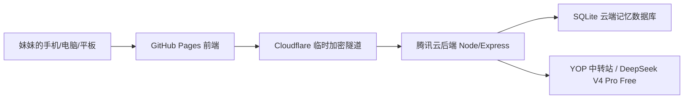

# Sakura Pocket / 百合口袋项目交接说明

这份文件给未来的 Codex 姐姐和妹妹本人看。新开对话时，先读这里，再继续改项目，可以减少上下文压缩带来的幻觉和重复解释。

## 1. 项目定位

百合口袋是一个网页端 AI 聊天陪伴应用。当前目标不是做恋爱软件，而是先做一个免费、可三端访问、以聊天陪伴和长期记忆为核心的百合向小应用。

核心方向：

- 百合陪伴聊天
- 角色预设：姐姐大人、雾岛怜、林秋实等
- 记忆系统：长期记忆、世界树、候选记忆、回收花园、云同步
- 三端体验：电脑、手机、平板都能打开网页使用
- 长期扩展：小说角色、插画、Live2D、游戏、百合帝国资料库

## 2. 当前已完成

- 前端已经能在 GitHub Pages 访问。
- 电脑端与手机端布局已经做过一轮适配。
- 手机返回/左滑已经接入浏览器历史，不会直接退出网页。
- 记忆、世界树、模型、设置、回收花园等页面已经有基础 UI。
- 记忆支持编辑、删除、恢复、永久删除、回收保留天数设置。
- 设置页支持回车发送、字体大小、主题颜色、自动捕捉记忆、回收保留策略。
- 后端已经部署到腾讯云服务器，并做成 systemd 开机自启服务。
- 云端同步接口已经可用，数据保存到服务器 SQLite。
- AI 模型调用已经切到 OpenAI-compatible 中转站。
- 旧 AstrBot / NapCat 服务已经从服务器清理掉，释放资源。
- GitHub 已经作为版本回溯和部署入口。

## 3. 重要地址与入口

线上前端：

- https://ctnnyy-oss.github.io/yuri-pocket/

GitHub 仓库：

- https://github.com/ctnnyy-oss/yuri-pocket

腾讯云服务器：

- SSH alias: `tencent-astrbot`
- 服务器 IP: `150.158.24.98`
- 后端目录: `/opt/yuri-pocket`
- 后端服务: `yuri-pocket-api.service`
- 临时加密隧道服务: `yuri-pocket-tunnel.service`

当前后端公开入口：

- 存在 `secrets/cloud-api-url.txt`
- 目前使用 Cloudflare Quick Tunnel，地址可能在服务重启后变化。

## 4. 密钥与敏感信息

不要把下面这些内容提交到 GitHub：

- `.env.local`
- `secrets/`
- 云端同步口令
- AI API 密钥
- 服务器 `.env`

本地敏感文件位置：

- 云同步口令：`secrets/cloud-sync-token.txt`
- 当前云端 API 地址：`secrets/cloud-api-url.txt`
- YOP 中转站密钥：`secrets/yop-api-key.txt`

服务器敏感配置：

- `/opt/yuri-pocket/.env`

服务器 `.env` 里应包含：

- `YURI_POCKET_SYNC_TOKEN`
- `YURI_POCKET_DB_PATH=/opt/yuri-pocket/data/yuri-pocket.sqlite`
- `AI_BASE_URL=https://api.yop.mom/v1`
- `AI_API_KEY`
- `AI_MODEL=deepseek/deepseek-v4-pro-free`

只允许在终端里验证密钥是否存在，不要打印密钥原文。

## 5. 当前架构



前端负责：

- UI
- 聊天界面
- 角色切换
- 设置页
- 本地 IndexedDB 数据
- 发起云同步与聊天请求

后端负责：

- 保存云端快照
- 保护 AI API 密钥
- 调用 OpenAI-compatible 模型
- 给前端提供 `/api/chat` 和 `/api/cloud/*`

GitHub 负责：

- 保存代码
- 版本回溯
- Pages 部署

腾讯云负责：

- 跑后端
- 保存 SQLite 数据库
- 持有密钥和同步口令

## 6. 部署与更新要点

本地开发：

```powershell
npm install
npm run dev
```

构建 GitHub Pages：

```powershell
$env:VITE_BASE_PATH='/yuri-pocket/'
$env:VITE_API_BASE_URL=(Get-Content -Raw .\secrets\cloud-api-url.txt).Trim()
npm run build
git add -f dist
git commit -m "your message"
git push origin main
```

服务器更新后端：

```powershell
ssh tencent-astrbot "cd /opt/yuri-pocket && git fetch --all --prune && git reset --hard origin/main && npm install --omit=dev --no-audit --no-fund && sudo systemctl restart yuri-pocket-api.service"
```

查看服务状态：

```powershell
ssh tencent-astrbot "systemctl is-active yuri-pocket-api.service yuri-pocket-tunnel.service"
```

查看隧道地址：

```powershell
ssh tencent-astrbot "sudo journalctl -u yuri-pocket-tunnel --no-pager -n 120 | grep -Eo 'https://[-a-zA-Z0-9]+\.trycloudflare\.com' | tail -n 1"
```

如果隧道地址变化，需要：

1. 更新本地 `secrets/cloud-api-url.txt`
2. 用新的 `VITE_API_BASE_URL` 重新构建
3. `git add -f dist`
4. commit + push

## 7. 现在还不够成熟的地方

短期限制：

- Cloudflare Quick Tunnel 是临时入口，不保证永久稳定。
- 还没有正式域名。
- 还没有用户账号系统，目前更像妹妹自己的私有应用。
- 云同步是整个 AppState 快照，不是细粒度多用户同步。
- 服务器 SQLite 已够 MVP 使用，但还没有自动备份策略。

中期建议：

- 买一个 `.com` 域名先占名字，但不要直接解析到大陆服务器，避免备案问题。
- 后续可考虑海外服务器、Cloudflare Pages、Cloudflare Named Tunnel。
- 给数据库加定时备份。
- 给每个用户做独立数据空间。
- 给模型供应商配置做 UI 管理，而不是只靠服务器 `.env`。

## 8. 下一轮最值得做的事

优先级从高到低：

1. 做一次真实手机体验回归，记录卡顿、遮挡、按钮难点。
2. 完善云同步 UI：显示云端最后更新时间、保存成功提示、读取前确认。
3. 给云端数据加备份按钮和自动备份脚本。
4. 把聊天消息也纳入更清晰的云端同步策略。
5. 优化模型错误提示，区分中转站错误、网络错误、密钥错误。
6. 继续打磨记忆系统：候选记忆审核、冲突提示、记忆使用日志。
7. 做一个新手使用页，告诉妹妹怎么连接云端、怎么保存、怎么恢复。
8. 等产品更稳定后，再处理正式域名和长期后端入口。

## 9. 新对话启动提示

妹妹新开 Codex 对话时，可以直接发：

```text
姐姐先读 C:\Users\MI\Desktop\AI\yuri-pocket\docs\PROJECT_HANDOFF.md，
再继续帮妹妹迭代百合口袋项目。不要重新猜架构，按文档里的当前状态继续。
```

如果要排查服务器：

```text
姐姐先检查 tencent-astrbot 上 yuri-pocket-api.service 和 yuri-pocket-tunnel.service。
不要打印任何密钥。
```

## 10. 姐姐的维护原则

- 每次大功能完成后，顺手更新本文件。
- 不把密钥、token、私人数据写进本文件。
- 不要为了重构而重构，优先保持妹妹能真实体验。
- 改 UI 前先考虑手机端。
- 记忆系统是灵魂，任何改动都不能破坏用户可编辑、可删除、可恢复、可永久删除。
- GitHub commit 是后悔药，大改之前先确认工作树干净。
